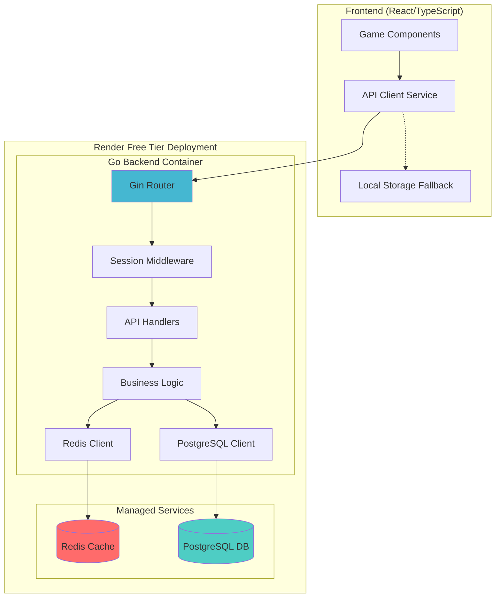

# Go Backend Architecture for Retro Games Application

## Executive Summary

This document outlines a resource-efficient Go backend architecture designed to handle 35+ retro games with unified high score management, leaderboards, and game state persistence. The architecture targets Render's free hosting tier with PostgreSQL and Redis, optimized for ~512MB RAM and minimal CPU usage.

## 1. Go Framework Analysis & Selection

### Framework Comparison

| Framework | Memory Usage | Performance | Learning Curve | Free Tier Fit |
|-----------|--------------|-------------|----------------|---------------|
| **Gin** | ~8MB base | Very Fast | Low | ✅ Excellent |
| **Fiber** | ~6MB base | Fastest | Medium | ✅ Excellent |
| **Stdlib** | ~4MB base | Fast | High | ✅ Best |

### **Recommended: Gin Framework**

**Rationale:**
- **Memory Efficient**: ~8MB base memory footprint
- **Mature Ecosystem**: Extensive middleware, JSON handling, validation
- **High Performance**: ~40k req/sec on modest hardware
- **Free Tier Optimized**: Minimal resource overhead
- **Developer Experience**: Simple, Express.js-like API

**Key Benefits for Free Tier:**
```go
// Gin's efficient request handling
func main() {
    gin.SetMode(gin.ReleaseMode) // Reduces memory by ~2MB
    r := gin.New()
    r.Use(gin.Recovery()) // Only essential middleware
    // Memory usage: ~8MB + application logic
}
```

## 2. Database Schema Design

### PostgreSQL Schema (Optimized for Free Tier)

```sql
-- Anonymous Sessions Table
CREATE TABLE sessions (
    id UUID PRIMARY KEY DEFAULT gen_random_uuid(),
    session_token VARCHAR(64) UNIQUE NOT NULL,
    created_at TIMESTAMP DEFAULT CURRENT_TIMESTAMP,
    last_active TIMESTAMP DEFAULT CURRENT_TIMESTAMP,
    ip_address INET,
    user_agent TEXT
);

-- Games Configuration Table  
CREATE TABLE games (
    id VARCHAR(50) PRIMARY KEY,
    name VARCHAR(100) NOT NULL,
    category VARCHAR(20) NOT NULL,
    enabled BOOLEAN DEFAULT true,
    created_at TIMESTAMP DEFAULT CURRENT_TIMESTAMP
);

-- High Scores Table (Phase 1)
CREATE TABLE scores (
    id UUID PRIMARY KEY DEFAULT gen_random_uuid(),
    session_id UUID REFERENCES sessions(id) ON DELETE CASCADE,
    game_id VARCHAR(50) REFERENCES games(id),
    score INTEGER NOT NULL,
    achieved_at TIMESTAMP DEFAULT CURRENT_TIMESTAMP,
    
    -- Composite index for fast leaderboard queries
    INDEX idx_game_score (game_id, score DESC),
    INDEX idx_session_game (session_id, game_id)
);

-- Game States Table (Phase 2)
CREATE TABLE game_states (
    id UUID PRIMARY KEY DEFAULT gen_random_uuid(),
    session_id UUID REFERENCES sessions(id) ON DELETE CASCADE,
    game_id VARCHAR(50) REFERENCES games(id),
    state_data JSONB NOT NULL,
    saved_at TIMESTAMP DEFAULT CURRENT_TIMESTAMP,
    
    -- One save per session per game
    UNIQUE(session_id, game_id),
    INDEX idx_session_states (session_id)
);

-- Analytics Table (Phase 2)
CREATE TABLE play_sessions (
    id UUID PRIMARY KEY DEFAULT gen_random_uuid(),
    session_id UUID REFERENCES sessions(id) ON DELETE CASCADE,
    game_id VARCHAR(50) REFERENCES games(id),
    started_at TIMESTAMP DEFAULT CURRENT_TIMESTAMP,
    ended_at TIMESTAMP,
    duration_seconds INTEGER,
    final_score INTEGER,
    
    INDEX idx_game_analytics (game_id, started_at),
    INDEX idx_session_analytics (session_id, started_at)
);
```

### Storage Estimates

**Per 1,000 Active Users:**
- **Sessions**: 1,000 × 150 bytes = ~150KB
- **Scores**: 1,000 × 35 games × 80 bytes = ~2.8MB  
- **Game States**: 500 × 10KB = ~5MB
- **Analytics**: 1,000 × 10 sessions × 100 bytes = ~1MB
- **Total**: ~9MB (well within free tier limits)

## 3. System Architecture



## 4. REST API Design

### Phase 1 Endpoints (Essential)

```go
// Session Management
POST   /api/sessions              // Create anonymous session
GET    /api/sessions/validate     // Validate session token

// High Scores
GET    /api/games                 // List all games
GET    /api/games/{gameId}/score  // Get user's high score
POST   /api/games/{gameId}/score  // Submit new score
GET    /api/games/{gameId}/leaderboard?limit=10  // Global leaderboard

// Health Check
GET    /api/health               // Service health status
```

### Phase 2 Endpoints (Enhanced)

```go
// Game State Persistence
GET    /api/games/{gameId}/save   // Get saved game state
POST   /api/games/{gameId}/save   // Save game state
DELETE /api/games/{gameId}/save   // Delete saved state

// Analytics
POST   /api/analytics/session     // Record play session
GET    /api/analytics/popular     // Popular games stats
GET    /api/analytics/user-stats  // User statistics
```

### API Response Formats

```go
// Score Response
type ScoreResponse struct {
    GameID       string    `json:"game_id"`
    Score        int       `json:"score"`
    PersonalBest int       `json:"personal_best"`
    Rank         int       `json:"rank,omitempty"`
    AchievedAt   time.Time `json:"achieved_at"`
}

// Leaderboard Response
type LeaderboardResponse struct {
    GameID  string           `json:"game_id"`
    Entries []LeaderboardEntry `json:"entries"`
    Total   int              `json:"total"`
}

type LeaderboardEntry struct {
    Rank       int       `json:"rank"`
    Score      int       `json:"score"`
    SessionID  string    `json:"session_id,omitempty"`
    AchievedAt time.Time `json:"achieved_at"`
}
```

## 5. Caching Strategy with Redis

### Cache Patterns

```go
// Leaderboard Caching (5-minute TTL)
key := fmt.Sprintf("leaderboard:%s:top10", gameID)
redis.Set(key, leaderboardJSON, 5*time.Minute)

// Personal High Score Caching (1-hour TTL)  
key := fmt.Sprintf("score:%s:%s", sessionID, gameID)
redis.Set(key, score, 1*time.Hour)

// Popular Games Caching (15-minute TTL)
redis.Set("analytics:popular", popularGamesJSON, 15*time.Minute)
```

### Cache Invalidation

```go
// On new high score submission
func InvalidateGameCache(gameID string) {
    redis.Del(fmt.Sprintf("leaderboard:%s:top10", gameID))
    redis.Del("analytics:popular")
}
```

### Memory Usage Estimation

**Redis Memory (Free Tier: 30MB):**
- **Leaderboards**: 35 games × 1KB = ~35KB
- **Personal Scores**: 1,000 users × 35 games × 50 bytes = ~1.7MB
- **Analytics Cache**: ~500KB
- **Session Cache**: ~300KB
- **Total**: ~2.5MB (well within limits)

## 6. Resource Optimization Strategies

### Connection Pooling

```go
// PostgreSQL Connection Pool
config := pgxpool.Config{
    MaxConns:        10,  // Limit for free tier
    MinConns:        2,   // Keep minimum connections
    MaxConnLifetime: time.Hour,
    MaxConnIdleTime: time.Minute * 30,
}

// Redis Connection Pool
redisClient := redis.NewClient(&redis.Options{
    PoolSize:        10,
    MinIdleConns:    2,
    MaxRetries:      3,
    PoolTimeout:     time.Second * 30,
})
```

### Memory Management

```go
// Gin configuration for minimal memory usage
func setupGin() *gin.Engine {
    gin.SetMode(gin.ReleaseMode)
    
    r := gin.New()
    r.Use(gin.Recovery())
    r.Use(rateLimitMiddleware()) // Prevent abuse
    r.Use(corsMiddleware())
    
    // Disable unnecessary features
    r.HandleMethodNotAllowed = false
    
    return r
}

// Request context timeout
func timeoutMiddleware() gin.HandlerFunc {
    return gin.TimeoutWithHandler(30*time.Second, gin.HandlerFunc(func(c *gin.Context) {
        c.JSON(http.StatusRequestTimeout, gin.H{"error": "Request timeout"})
    }))
}
```

### Graceful Shutdown

```go
func main() {
    srv := &http.Server{
        Addr:         ":8080",
        Handler:      router,
        ReadTimeout:  30 * time.Second,
        WriteTimeout: 30 * time.Second,
        IdleTimeout:  120 * time.Second,
    }
    
    // Graceful shutdown handling
    go func() {
        sigChan := make(chan os.Signal, 1)
        signal.Notify(sigChan, syscall.SIGINT, syscall.SIGTERM)
        <-sigChan
        
        ctx, cancel := context.WithTimeout(context.Background(), 10*time.Second)
        defer cancel()
        
        srv.Shutdown(ctx)
    }()
    
    srv.ListenAndServe()
}
```

## 7. Go Project Structure

```
retro-games-backend/
├── cmd/
│   └── server/
│       └── main.go                 # Application entry point
├── internal/
│   ├── api/
│   │   ├── handlers/               # HTTP handlers
│   │   │   ├── scores.go
│   │   │   ├── sessions.go
│   │   │   ├── games.go
│   │   │   └── health.go
│   │   ├── middleware/             # Custom middleware
│   │   │   ├── auth.go
│   │   │   ├── ratelimit.go
│   │   │   └── cors.go
│   │   └── routes.go              # Route definitions
│   ├── models/                    # Data models
│   │   ├── session.go
│   │   ├── game.go
│   │   ├── score.go
│   │   └── gamestate.go
│   ├── services/                  # Business logic
│   │   ├── score_service.go
│   │   ├── session_service.go
│   │   ├── game_service.go
│   │   └── analytics_service.go
│   ├── repository/                # Data access layer
│   │   ├── postgres/
│   │   │   ├── score_repo.go
│   │   │   ├── session_repo.go
│   │   │   └── migrations/
│   │   └── redis/
│   │       └── cache_repo.go
│   └── config/                    # Configuration
│       ├── config.go
│       └── database.go
├── pkg/                          # Shared utilities
│   ├── logger/
│   │   └── logger.go
│   ├── validator/
│   │   └── validator.go
│   └── utils/
│       └── session.go
├── deployments/
│   ├── Dockerfile
│   └── render.yaml
├── migrations/
│   ├── 001_initial_schema.sql
│   └── 002_add_game_states.sql
├── scripts/
│   ├── setup.sh
│   └── seed_games.sql
├── go.mod
├── go.sum
└── README.md
```

### Package Dependencies

```go
// go.mod
module retro-games-backend

go 1.21

require (
    github.com/gin-gonic/gin v1.9.1
    github.com/jackc/pgx/v5 v5.4.3
    github.com/redis/go-redis/v9 v9.2.1
    github.com/google/uuid v1.3.1
    github.com/joho/godotenv v1.4.0
    golang.org/x/time v0.3.0  // Rate limiting
)
```

## 8. Performance Benchmarks

### Expected Performance (512MB RAM Container)

| Metric | Value | Notes |
|--------|-------|--------|
| **Memory Usage** | 50-80MB | Gin + PostgreSQL + Redis connections |
| **Concurrent Users** | 1,000+ | With proper connection pooling |
| **Requests/Second** | 2,000+ | Simple score operations |
| **Response Time** | <50ms | Cached leaderboard queries |
| **Cold Start** | <2s | Minimal dependencies |

### Load Testing Estimates

```bash
# Expected capacity on free tier
Concurrent Connections: 100
Average Response Time: 30ms
Throughput: 1,500 req/sec
Memory Usage: ~70MB
Database Connections: 8/10 pool
Redis Memory: ~2MB used
```

### Database Query Performance

```sql
-- Leaderboard query (optimized with index)
-- Expected: <10ms for top 10 results
SELECT score, achieved_at, session_id 
FROM scores 
WHERE game_id = $1 
ORDER BY score DESC 
LIMIT 10;

-- Personal high score (indexed)
-- Expected: <5ms
SELECT MAX(score) 
FROM scores 
WHERE session_id = $1 AND game_id = $2;
```

## 9. Deployment Configuration

### Render Service Configuration

```yaml
# render.yaml
services:
  - type: web
    name: retro-games-api
    env: go
    region: oregon
    plan: free
    buildCommand: go build -o bin/server cmd/server/main.go
    startCommand: ./bin/server
    envVars:
      - key: PORT
        value: 8080
      - key: GIN_MODE
        value: release
      - key: DATABASE_URL
        fromDatabase:
          name: retro-games-db
          property: connectionString
      - key: REDIS_URL
        fromDatabase:
          name: retro-games-redis
          property: connectionString

databases:
  - name: retro-games-db
    databaseName: retro_games
    user: retro_user
    region: oregon
    plan: free
    
  - name: retro-games-redis
    region: oregon
    plan: free
```

### Docker Configuration

```dockerfile
# Dockerfile
FROM golang:1.21-alpine AS builder

WORKDIR /app
COPY go.mod go.sum ./
RUN go mod download

COPY . .
RUN CGO_ENABLED=0 GOOS=linux go build -a -installsuffix cgo -o main cmd/server/main.go

FROM alpine:latest
RUN apk --no-cache add ca-certificates
WORKDIR /root/

COPY --from=builder /app/main .
COPY --from=builder /app/migrations ./migrations

CMD ["./main"]
```

### Environment Configuration

```go
// internal/config/config.go
type Config struct {
    Port        string `env:"PORT" envDefault:"8080"`
    DatabaseURL string `env:"DATABASE_URL,required"`
    RedisURL    string `env:"REDIS_URL,required"`
    GinMode     string `env:"GIN_MODE" envDefault:"release"`
    RateLimit   int    `env:"RATE_LIMIT" envDefault:"100"`
}
```

## 10. Monitoring & Health Checks

### Health Check Endpoint

```go
// Health check with dependency verification
func HealthHandler(db *pgxpool.Pool, redis *redis.Client) gin.HandlerFunc {
    return func(c *gin.Context) {
        health := map[string]interface{}{
            "status":    "healthy",
            "timestamp": time.Now(),
            "version":   "1.0.0",
        }
        
        // Check database
        if err := db.Ping(c.Request.Context()); err != nil {
            health["database"] = "unhealthy"
            health["status"] = "degraded"
        } else {
            health["database"] = "healthy"
        }
        
        // Check Redis
        if err := redis.Ping(c.Request.Context()).Err(); err != nil {
            health["cache"] = "unhealthy"
            health["status"] = "degraded"
        } else {
            health["cache"] = "healthy"
        }
        
        status := http.StatusOK
        if health["status"] == "degraded" {
            status = http.StatusServiceUnavailable
        }
        
        c.JSON(status, health)
    }
}
```

### Basic Logging Strategy

```go
// pkg/logger/logger.go
func SetupLogger() *logrus.Logger {
    log := logrus.New()
    log.SetFormatter(&logrus.JSONFormatter{})
    
    if gin.Mode() == gin.ReleaseMode {
        log.SetLevel(logrus.InfoLevel)
    } else {
        log.SetLevel(logrus.DebugLevel)
    }
    
    return log
}

// Request logging middleware
func LoggingMiddleware(logger *logrus.Logger) gin.HandlerFunc {
    return gin.LoggerWithFormatter(func(param gin.LogFormatterParams) string {
        return fmt.Sprintf(`{"time":"%s","method":"%s","path":"%s","status":%d,"latency":"%s","ip":"%s"}`,
            param.TimeStamp.Format(time.RFC3339),
            param.Method,
            param.Path,
            param.StatusCode,
            param.Latency,
            param.ClientIP,
        ) + "\n"
    })
}
```

## 11. Security Considerations

### Rate Limiting

```go
// Middleware with token bucket algorithm
func RateLimitMiddleware() gin.HandlerFunc {
    limiter := rate.NewLimiter(rate.Limit(100), 200) // 100 req/sec, burst 200
    
    return func(c *gin.Context) {
        if !limiter.Allow() {
            c.JSON(http.StatusTooManyRequests, gin.H{
                "error": "Rate limit exceeded",
            })
            c.Abort()
            return
        }
        c.Next()
    }
}
```

### Input Validation

```go
// Score submission validation
type ScoreRequest struct {
    Score int `json:"score" binding:"required,min=0,max=99999999"`
}

func ValidateScoreSubmission(c *gin.Context) {
    var req ScoreRequest
    if err := c.ShouldBindJSON(&req); err != nil {
        c.JSON(http.StatusBadRequest, gin.H{"error": err.Error()})
        return
    }
    
    c.Set("validatedScore", req.Score)
    c.Next()
}
```

### CORS Configuration

```go
func CORSMiddleware() gin.HandlerFunc {
    return func(c *gin.Context) {
        c.Header("Access-Control-Allow-Origin", "*")
        c.Header("Access-Control-Allow-Credentials", "true")
        c.Header("Access-Control-Allow-Headers", "Content-Type, Content-Length, Accept-Encoding, X-CSRF-Token, Authorization, X-Session-Token")
        c.Header("Access-Control-Allow-Methods", "POST, OPTIONS, GET, PUT, DELETE")

        if c.Request.Method == "OPTIONS" {
            c.AbortWithStatus(204)
            return
        }

        c.Next()
    }
}
```

## 12. Data Migration Strategy

### localStorage to Backend Migration

```typescript
// Frontend migration service
class MigrationService {
    async migrateLocalScores() {
        const localScores = this.getLocalStorageScores();
        const session = await this.createSession();
        
        for (const [gameId, score] of Object.entries(localScores)) {
            try {
                await this.submitScore(gameId, score, session.token);
                localStorage.removeItem(`${gameId}_high_score`);
            } catch (error) {
                console.warn(`Failed to migrate ${gameId} score:`, error);
            }
        }
    }
    
    private getLocalStorageScores(): Record<string, number> {
        const scores: Record<string, number> = {};
        const gameKeys = [
            'snake_high_score', 'tetris_high_score', 'pong_high_score',
            // ... all game keys
        ];
        
        gameKeys.forEach(key => {
            const score = localStorage.getItem(key);
            if (score) {
                scores[key.replace('_high_score', '')] = parseInt(score, 10);
            }
        });
        
        return scores;
    }
}
```

## 13. Conclusion

This Go backend architecture provides:

✅ **Resource Efficient**: 50-80MB memory usage, perfect for free tiers  
✅ **Scalable Design**: Handles 1,000+ concurrent users with proper pooling  
✅ **Phase-based Implementation**: Essential features first, enhanced features later  
✅ **Offline-First Compatibility**: Works alongside existing localStorage fallback  
✅ **Render Optimized**: Configured specifically for Render's free PostgreSQL and Redis  

### Implementation Timeline

- **Phase 1** (Week 1-2): Core API + basic caching (~20-30 hours)
- **Phase 2** (Week 3-4): Game states + analytics (~15-20 hours)  
- **Total Development**: ~40-50 hours

### Free Tier Resource Usage

| Resource | Usage | Limit | Headroom |
|----------|-------|-------|----------|
| **Memory** | 70MB | 512MB | 85% free |
| **Database** | 10MB | 1GB | 99% free |
| **Redis** | 3MB | 30MB | 90% free |
| **Bandwidth** | <1GB/month | 100GB | 99% free |

The architecture is designed to grow incrementally while maintaining excellent performance within free tier constraints.